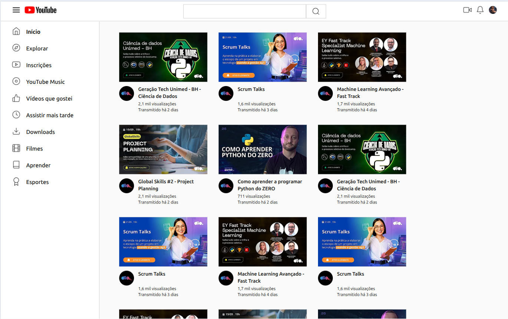
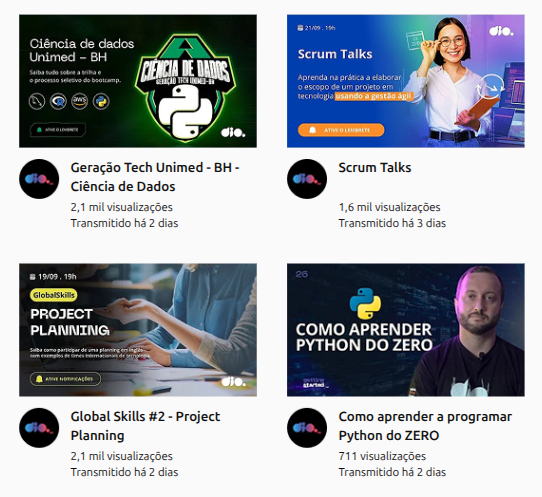

# YouTube — CSS Grid Layout

### Projeto Front-end | HTML e CSS

Projeto desenvolvido como desafio prático de **CSS Grid**, com o objetivo de reproduzir uma interface de listagem inspirada no YouTube e aplicar diferentes estratégias de organização de layouts utilizando HTML e CSS.

O projeto faz parte da minha formação complementar em desenvolvimento Front-end pela **DIO** e foi utilizado para consolidar conhecimentos em **CSS Grid, Flexbox, organização de componentes, posicionamento e estruturação visual de interfaces**.

🌐 **[Ver projeto online](https://diegodemelo.github.io/trilha-css-desafio-grid-layout/)**

## Demonstração

### Layout principal



### Cards de vídeo



---

## Sobre o projeto

A interface reproduz, para fins educacionais, uma página de listagem de vídeos inspirada no layout do YouTube.

A página possui:

- cabeçalho;
- área visual de busca;
- menu lateral;
- atalhos de navegação;
- grade de vídeos;
- thumbnails;
- avatar do canal;
- título do conteúdo;
- informações de visualização.

O principal objetivo do projeto foi praticar a utilização do **CSS Grid como ferramenta de composição de layouts**.

---

## Objetivos

O projeto foi desenvolvido para exercitar:

- HTML;
- CSS;
- CSS Grid;
- Grid Areas;
- Grid Template Columns;
- Grid Template Rows;
- Flexbox;
- organização de componentes;
- criação de sidebar;
- construção de cards;
- alinhamento;
- espaçamento;
- posicionamento;
- reutilização de variáveis CSS.

---

## Tecnologias utilizadas

| Tecnologia | Aplicação |
|---|---|
| HTML5 | Estrutura da interface |
| CSS3 | Estilização |
| CSS Grid | Organização estrutural do layout |
| Flexbox | Distribuição dos cards e alinhamentos |
| CSS Variables | Centralização de valores reutilizados |

O projeto foi desenvolvido utilizando apenas tecnologias nativas da Web, sem frameworks ou bibliotecas JavaScript.

---

## Estrutura do projeto

```text
trilha-css-desafio-grid-layout/
│
├── assets/
│   ├── css/
│   │   └── style.css
│   │
│   └── img/
│       └── imagens utilizadas pela interface
│
└── index.html
```

---

## Estrutura da interface

A página pode ser representada conceitualmente desta forma:

```text
┌─────────────────────────────────────────────┐
│                    HEADER                   │
├───────────────┬─────────────────────────────┤
│               │                             │
│    SIDEBAR    │         CONTEÚDO            │
│               │                             │
│               │   Cards de vídeos           │
│               │                             │
└───────────────┴─────────────────────────────┘
```

Essa divisão é construída combinando diferentes estruturas de CSS Grid.

---

## Header

O cabeçalho da aplicação foi dividido em três áreas principais:

```text
START        CENTER        END
```

Visualmente:

```text
┌────────────────────────────────────────────┐
│ Menu + Logo │     Busca     │ Ações + User │
└────────────────────────────────────────────┘
```

O CSS utiliza áreas nomeadas:

```css
grid:
  "start center end" 56px /
  1fr 2fr 1fr;
```

Cada parte recebe sua área correspondente:

```css
grid-area: start;
grid-area: center;
grid-area: end;
```

Essa abordagem facilita a visualização e manutenção da estrutura do cabeçalho.

---

## Área inicial do header

A primeira área contém:

- botão visual de menu;
- logotipo inspirado no YouTube.

Sua organização interna utiliza Flexbox para alinhar os elementos horizontalmente.

---

## Área central

A região central representa visualmente a pesquisa da plataforma.

Ela contém:

- área de entrada;
- botão de busca.

Os elementos são centralizados e distribuídos utilizando Flexbox dentro da área definida pelo Grid.

---

## Área final

A última região do header apresenta:

- ícone de vídeo;
- notificações;
- avatar do usuário.

Os itens são alinhados à direita dentro da área:

```text
end
```

---

## Layout principal

A estrutura principal da página utiliza:

```css
grid-template-columns:
  var(--sidebar-width) 1fr;
```

Conceitualmente:

```text
┌──────────────┬─────────────────────────────┐
│              │                             │
│   280px      │       espaço restante      │
│              │                             │
│   Sidebar    │         Conteúdo            │
│              │                             │
└──────────────┴─────────────────────────────┘
```

A largura da sidebar é controlada pela variável:

```css
--sidebar-width: 280px;
```

O restante da área disponível é destinado à listagem dos vídeos.

---

## Sidebar

O menu lateral também utiliza CSS Grid.

Sua estrutura possui duas colunas:

```css
grid-template-columns: auto 1fr;
```

Isso permite organizar cada item em:

```text
Ícone | Texto
```

Exemplo:

```text
🏠  Início
🧭  Explorar
▶️  Inscrições
💿  YouTube Music
👍  Vídeos que gostei
🕒  Assistir mais tarde
⬇️  Downloads
🎬  Filmes
📖  Aprender
🏆  Esportes
```

A interface real utiliza imagens para representar os ícones.

---

## Sidebar fixa durante a rolagem

A barra lateral utiliza:

```css
position: sticky;
top: var(--header-height);
```

Sua altura é calculada considerando o espaço ocupado pelo header:

```css
height: calc(
  100vh - var(--header-height)
);
```

Isso permite que o menu permaneça posicionado na tela durante a navegação vertical da área principal.

---

## Listagem dos vídeos

A área principal contém diferentes cards de conteúdo.

Entre os títulos utilizados no projeto estão exemplos relacionados a:

- Ciência de Dados;
- Scrum;
- Machine Learning;
- Project Planning;
- Python.

A página possui múltiplos cards distribuídos na área disponível.

---

## Organização dos cards

O container utiliza Flexbox:

```css
display: flex;
flex-direction: row;
flex-wrap: wrap;
```

Dessa forma, os cards são distribuídos horizontalmente e podem quebrar para uma nova linha quando o espaço disponível é ocupado.

A solução combina:

```text
CSS Grid
+
Flexbox
```

utilizando cada tecnologia conforme sua finalidade no layout.

---

## Estrutura de um card

Cada card possui três partes principais:

```text
Thumbnail
Avatar
Informações
```

A organização interna utiliza CSS Grid:

```css
grid:
  "header header" 140px
  "avatar title" 1fr
  / 42px 4fr;
```

Visualmente:

```text
┌─────────────────────────────┐
│                             │
│          Thumbnail          │
│                             │
├──────┬──────────────────────┤
│      │ Título do vídeo      │
│Avatar│ Visualizações        │
│      │ Data                 │
└──────┴──────────────────────┘
```

---

## Grid Areas

As partes do card utilizam áreas nomeadas.

### Thumbnail

```css
grid-area: header;
```

### Avatar

```css
grid-area: avatar;
```

### Informações

```css
grid-area: title;
```

Essa técnica permite definir visualmente a posição dos componentes diretamente na configuração do Grid.

---

## CSS Grid utilizado no projeto

O projeto apresenta diferentes formas de utilização do Grid.

### Header

```text
start | center | end
```

### Layout principal

```text
sidebar | conteúdo
```

### Menu lateral

```text
ícone | texto
```

### Card

```text
thumbnail thumbnail
avatar    informações
```

Essas diferentes aplicações permitem estudar CSS Grid em mais de um nível da interface.

---

## Flexbox utilizado no projeto

Flexbox complementa o Grid em elementos que precisam principalmente de alinhamento e distribuição.

Ele é utilizado em áreas como:

- elementos internos do header;
- agrupamento de ícones;
- alinhamento de componentes;
- área dos cards;
- distribuição da listagem.

Essa combinação demonstra que Grid e Flexbox não são tecnologias concorrentes.

Cada uma pode ser aplicada ao tipo de problema de layout que resolve melhor.

---

## Design Tokens

O arquivo CSS utiliza variáveis em:

```css
:root
```

para centralizar valores utilizados pela interface.

Exemplo:

```css
:root {
  --text: #111;
  --muted: #555;

  --bg: #fafafa;
  --surface: #fff;

  --border: #cccccc;

  --header-height: 56px;
  --sidebar-width: 280px;
}
```

Também existem tokens relacionados a:

- tipografia;
- espaçamentos;
- bordas;
- dimensões;
- estados visuais.

Essa organização reduz a repetição de valores ao longo da folha de estilos.

---

## Header sticky

O cabeçalho utiliza:

```css
position: sticky;
top: 0;
```

fazendo com que permaneça visível durante a rolagem da página.

O `z-index` é utilizado para manter o elemento sobre o restante do conteúdo.

---

## Imagens

Os assets incluem:

- logotipo;
- ícones do header;
- ícones da sidebar;
- thumbnails;
- avatar de canal;
- avatar de usuário.

A regra global:

```css
img {
  max-width: 100%;
  height: auto;
}
```

contribui para que as imagens respeitem as dimensões dos containers.

---

## Conceitos praticados

### CSS Grid

Organização de layouts em linhas e colunas.

### Grid Areas

Nomeação de áreas para facilitar a distribuição dos componentes.

### Grid Template

Definição explícita da estrutura visual da interface.

### Flexbox

Distribuição e alinhamento de elementos em um único eixo.

### Sticky Positioning

Manutenção do header e da sidebar em posições específicas durante a rolagem.

### CSS Variables

Centralização e reutilização de valores.

### Componentização visual

Separação da interface em regiões com responsabilidades distintas.

---

## Executando o projeto

Clone o repositório:

```bash
git clone https://github.com/diegodemelo/trilha-css-desafio-grid-layout.git
```

Entre no diretório:

```bash
cd trilha-css-desafio-grid-layout
```

Abra o arquivo:

```text
index.html
```

diretamente no navegador.

Também é possível utilizar uma extensão como **Live Server** no Visual Studio Code.

---

## Projeto educacional

Este projeto foi desenvolvido como parte da minha formação complementar na **DIO**, em um desafio voltado à reprodução de uma interface semelhante à listagem de vídeos do YouTube utilizando **CSS Grid Layout**.

O projeto tem finalidade exclusivamente educacional.

A marca YouTube e os elementos visuais utilizados como referência pertencem aos seus respectivos titulares e são utilizados aqui apenas para fins de estudo e prática de desenvolvimento Front-end.

---

## Aprendizados

O desenvolvimento deste projeto contribuiu para consolidar conhecimentos relacionados a:

- HTML;
- CSS;
- CSS Grid;
- Grid Areas;
- Grid Templates;
- Flexbox;
- layouts de múltiplas colunas;
- sidebar;
- criação de cards;
- posicionamento sticky;
- variáveis CSS;
- organização visual;
- estruturação de interfaces;
- Git e GitHub.

---

## Possíveis evoluções

Como projeto educacional, existem diferentes oportunidades de melhoria:

- implementação de responsividade para telas menores;
- criação de breakpoints;
- melhoria da acessibilidade;
- adição de textos alternativos significativos às imagens;
- substituição da área visual de busca por um campo de formulário real;
- revisão da semântica HTML;
- correção de identificadores HTML repetidos;
- implementação de estados de interação;
- otimização dos assets;

---

## Status

**Projeto educacional concluído.**

O repositório permanece disponível como demonstração prática dos estudos em **CSS Grid Layout e organização de interfaces Front-end**.

---

## Autor

**Diego de Melo**

Desenvolvedor Full Stack Júnior

**Stack:**  
JavaScript • TypeScript • React • Next.js • Node.js • PostgreSQL

**LinkedIn:** 
[Diego de Melo](https://www.linkedin.com/in/diegodemelodev)

**GitHub:**  
[@diegodemelo](https://github.com/diegodemelo)

---

### HTML • CSS • CSS Grid • Flexbox • Layout
